# Online Book Store Management System

## UML Diagram

  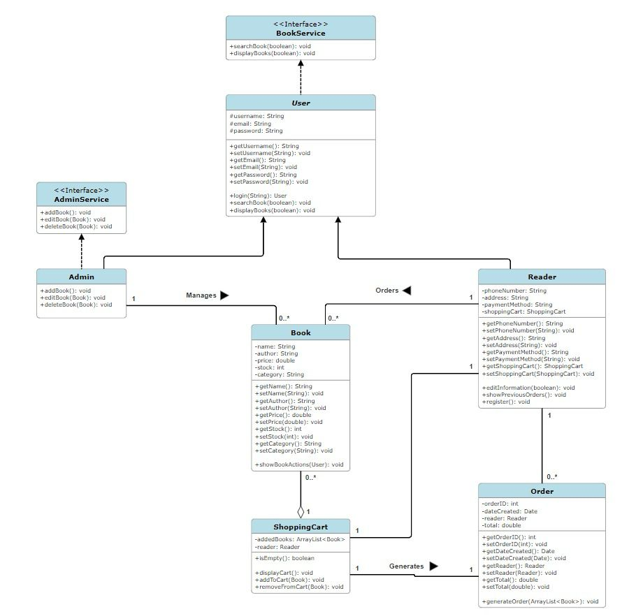

Figure 1: UML Diagram

## Overview of the System

  

Figure 2: Main Menu

  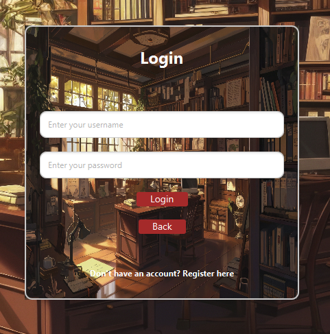

Figure 3: Login Page

## Admin Functions

  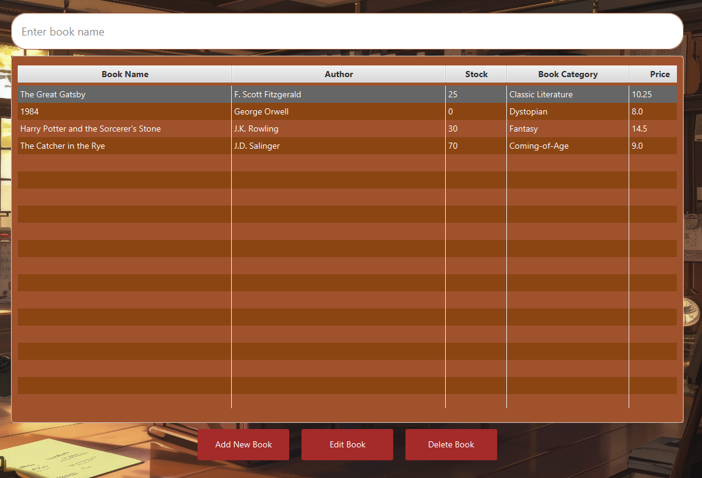

Figure 4: Admin Menu

  

Figure 5: Admin Functions Overview

### Add a Book
The admin can add new books to the store's inventory using the "Add New Book" dialog. Once the admin fills in the book's data, pressing save will call the `addBook(Book book)` method.

  

Figure 6: Add New Book Dialog

  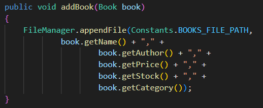

Figure 7: addBook Implementation

### Edit a Book
The admin can edit the details of an existing book using the "Edit Book" dialog. Once the admin modifies the book's data, pressing save will call the `editBook(Book book, Book updatedBook)` method.

  

Figure 8: Edit Book Dialog

  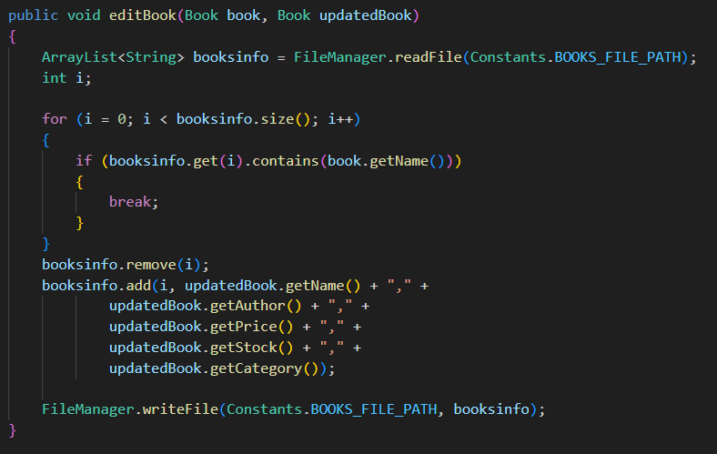

Figure 9: editBook Implementation

### Delete a Book
The admin can remove a book from the store's inventory using the `deleteBook(Book book)` method.

  

Figure 10: Delete Book Button

  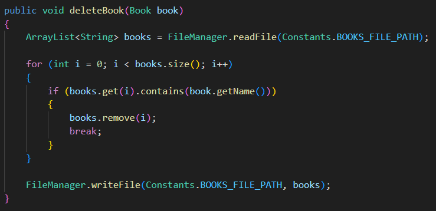

Figure 11: deleteBook Implementation

## Reader Functions
New users can register as readers. Once the user fills in the required data, pressing Register will call the `register(String email, String username, String password, String phoneNumber, String address, String paymentMethod)` method.

  

Figure 12: Registration Form

  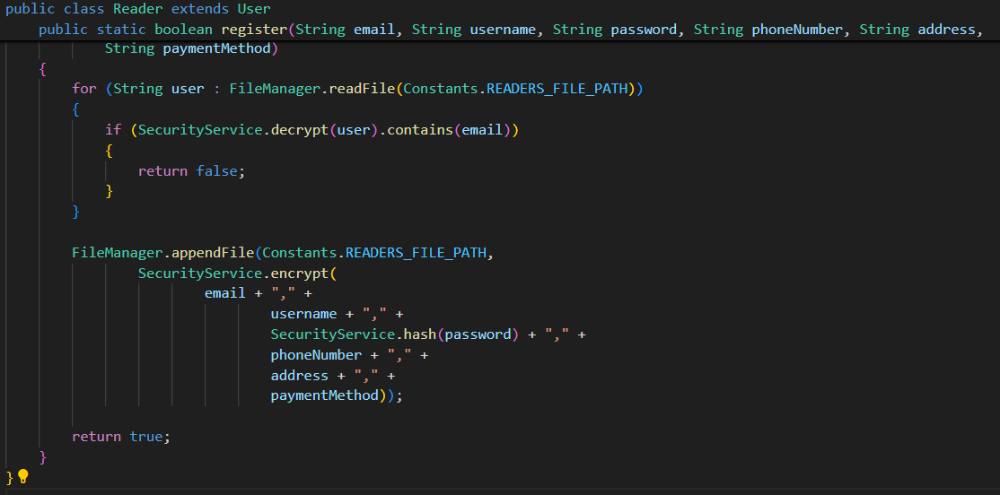

Figure 13: register Implementation

  

Figure 14: Reader Menu

### Edit Account Information
The reader can edit their account information using the Edit Account Information page. Once the reader has modified their data, pressing yes will call the `updateReaderInformation()` method, which will update the user's data in the bookstore's database.

  

Figure 15: Edit Information Page

  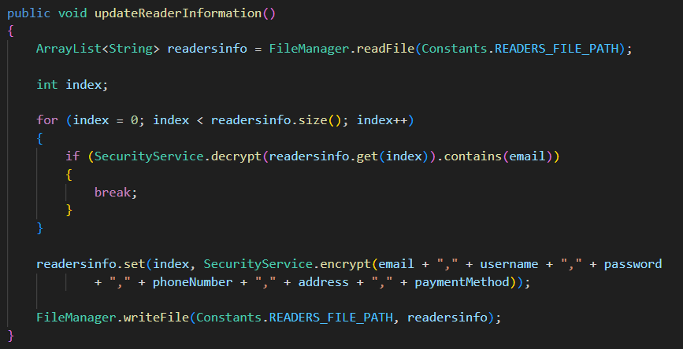

Figure 16: updateReaderInformation Implementation

### Show Previous Orders
The reader can view all their previous orders on this page.

  

Figure 17: Show Previous Orders Page

  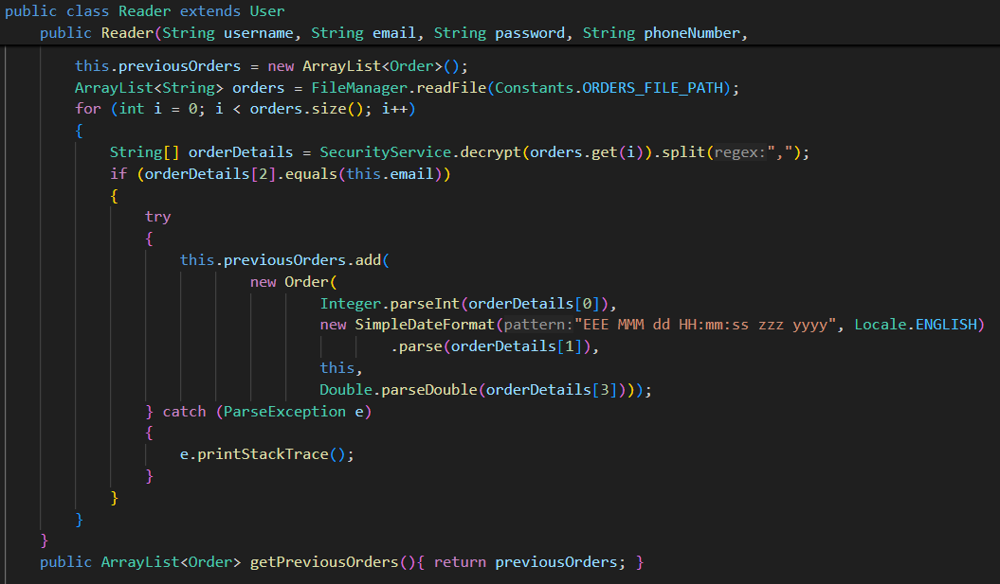

Figure 18: Initialization of the previousOrders ArrayList

### Display Books
The reader can view all books *with stock more than 0* and can search for a specific book. The reader can select a book and add it to the cart.

  

Figure 19: Display Books Page

Adding a book to the cart with the Add to Cart button will call the `addToCart(Book book)` method.

  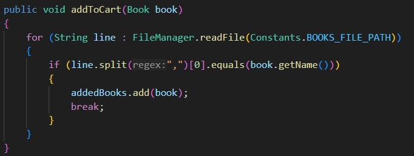

Figure 20: addToCart Implementation

### Display Cart
The reader can view the books currently in their shopping cart on this page.

  

Figure 21: Your Cart Page

The reader can also remove books from the cart, which will call the `removeFromCart(Book bookToRemove)` method.

  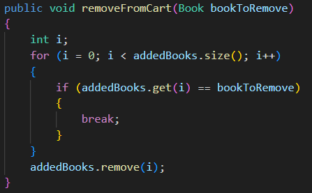

Figure 22: removeFromCart Implementation

### Go To Receipt
In the receipt page, the user can use the Pay button, which will call the `generateOrder(ArrayList<Book> books)` method.

  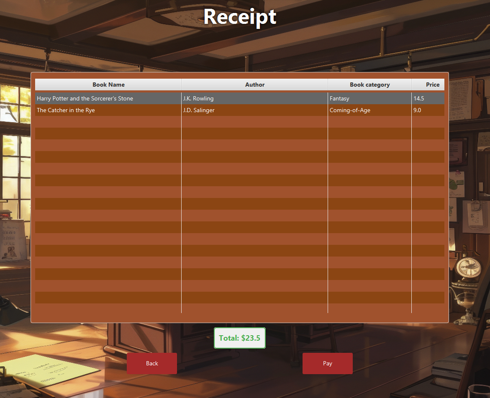

Figure 23: Receipt page

  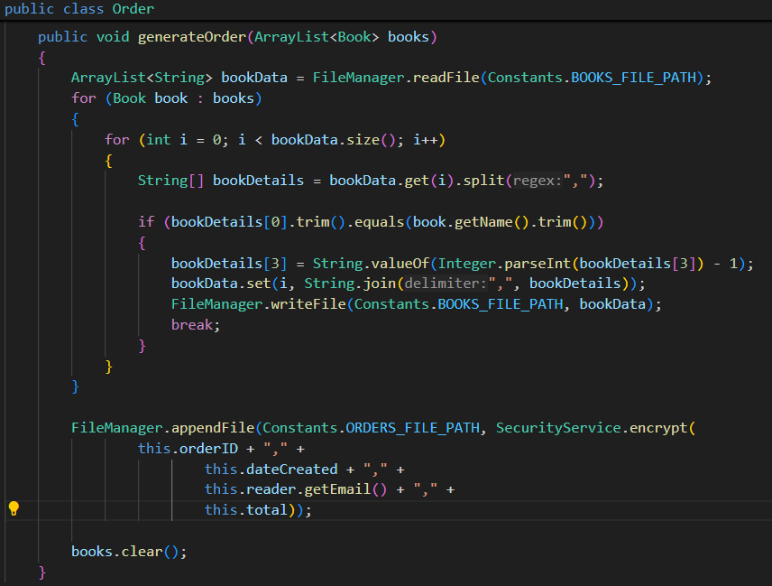

Figure 24: generateOrder Implementation

